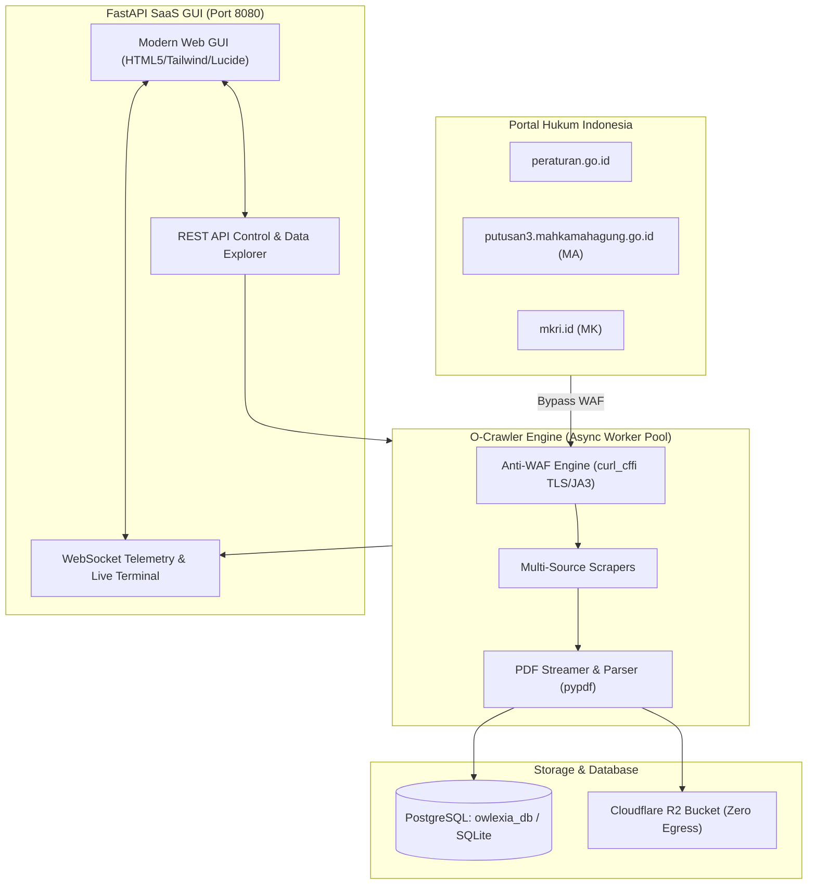

# 🦅 O-Crawler (Legal Crawler, Court Ingestion Engine & SaaS Dashboard)

[]()
[]()
[]()
[]()
[]()
[]()
[]()

**O-Crawler** adalah mesin *crawler*, *extractor*, dan *pipeline ingestion* dokumen hukum Indonesia modern berbasis Python & FastAPI yang dirancang untuk mengunduh, mengekstrak, dan mengindeks:
1. **Regulasi Resmi**: Dari portal [peraturan.go.id](https://peraturan.go.id) (UU, PP, Perpres, Permen, Perda, dll.).
2. **Putusan Mahkamah Agung RI**: Dari portal [putusan3.mahkamahagung.go.id](https://putusan3.mahkamahagung.go.id) (Kasasi, Peninjauan Kembali, Tipikor, Perdata, Pidana, TUN, Pajak, dll.).
3. **Putusan Mahkamah Konstitusi RI**: Dari portal [mkri.id](https://www.mkri.id) (Pengujian UU [PUU], SKLN, Sengketa Pemilu [PHPU], dan Sengketa Pilkada [PHPKADA]).

Aplikasi ini dilengkapi antarmuka **Modern SaaS GUI** yang super cepat dengan konkurensi multi-worker, visualisasi telemetri real-time, terminal log langsung via WebSocket, data explorer interaktif, dan integrasi publikasi Cloudflare Tunnel ke `ocrawler.sugarate.me` (`ocrawler.cugarete.me`).

---

## 🌟 Fitur Utama

- 🖥️ **Modern SaaS GUI & Dashboard**: Antarmuka web modern responsif (desain Hallmark token-based) yang dapat dibuka di browser lokal maupun desktop.
- ⚡ **High-Speed Async Worker Pool**: Mesin crawling asinkron berbasis `asyncio` dengan konkurensi dinamis (1–20 workers secara simultan), meningkatkan kecepatan 5x–15x lipat.
- 🏛️ **Dukungan Multi-Sumber Hukum Lengkap**:
  - **Peraturan.go.id**: Ekstraksi hierarkis BAB, Pasal, Penjelasan, dan metadata status peraturan.
  - **Mahkamah Agung (MA)**: Ekstraksi nomor perkara, para pihak, tingkat proses, majelis hakim, amar putusan, dan berkas salinan PDF resmi.
  - **Mahkamah Konstitusi (MK)**: Ekstraksi putusan PUU, SKLN, PHPU, pemohon, amar putusan, dan unduhan berkas PDF dari CDN `s.mkri.id`.
- 🛡️ **Anti-WAF TLS/JA3 Bypass**: Menggunakan `curl_cffi` dengan impersonasi profil browser Safari 17 / Chrome 120, cookie caching ke disk, dan auto-retry backoff untuk menembus proteksi Cloudflare WAF.
- 🗄️ **Unified Database (PostgreSQL & SQLite Fallback)**:
  - Menyimpan data ke tabel `regulations`, `legal_articles`, dan `court_decisions` di PostgreSQL `owlexia_db`.
  - Otomatis beralih ke SQLite lokal (`ocrawler.db`) jika PostgreSQL belum diaktifkan (zero-setup desktop mode).
- ☁️ **Cloudflare R2 Streaming Storage**: Berkas PDF otomatis diunggah ke Cloudflare R2 secara streaming tanpa membebani RAM, lalu berkas lokal dibersihkan agar harddisk server lokal tetap 0 MB terpakai.
- 🌐 **Cloudflare Tunnel Ready**: Siap diakses secara aman dari internet melalui `https://ocrawler.sugarate.me` atau `https://ocrawler.cugarete.me`.

---

## 🏗️ Arsitektur Sistem



---

## 🚀 Panduan Menjalankan Aplikasi

### 1. Menjalankan Modern SaaS GUI (Direkomendasikan)
Cukup jalankan skrip launcher berikut di terminal:
```bash
./run_gui.sh
```
Aplikasi akan aktif di:
- **Lokal Desktop / Browser**: [http://localhost:8080](http://localhost:8080)
- **Subdomain Publik**: [https://ocrawler.sugarate.me](https://ocrawler.sugarate.me) (atau `https://ocrawler.cugarete.me`)

### 2. Mode Terminal CLI (Untuk Otomasi / Scripting / Cron Job)
Anda juga dapat menjalankan crawling langsung via command line:
```bash
# Crawl 5 halaman UU
./venv/bin/python anti_waf_crawler.py --category uu --pages 5

# Crawl Putusan MA via Python Scraper
./venv/bin/python -c "
import asyncio
from crawler_engine import CrawlerEngine
engine = CrawlerEngine()
asyncio.run(engine.start_crawl({'source': 'ma', 'category': 'pidana-khusus-1', 'pages': 2, 'concurrency': 5}))
"

# Crawl Putusan MK (Pengujian UU)
./venv/bin/python -c "
import asyncio
from crawler_engine import CrawlerEngine
engine = CrawlerEngine()
asyncio.run(engine.start_crawl({'source': 'mk', 'category': 'PUU', 'pages': 2, 'concurrency': 5}))
"
```

---

## 📡 REST API & WebSocket Documentation

| Method | Endpoint | Deskripsi |
| :--- | :--- | :--- |
| `GET` | `/` | Dashboard Web GUI (Single-Page App) |
| `WS` | `/ws/crawler` | Live WebSocket streaming untuk progres & terminal log |
| `GET` | `/api/stats` | Statistik total regulasi, pasal, putusan MA & MK |
| `GET` | `/api/crawl/status` | Status engine aktif, kecepatan (dok/dtk), progres |
| `POST` | `/api/crawl/start` | Memulai crawl job baru (`source`, `category`, `query`, `pages`, `concurrency`) |
| `POST` | `/api/crawl/stop` | Menghentikan crawl job yang sedang berjalan |
| `GET` | `/api/data/regulations` | Daftar regulasi tersimpan dengan fitur pencarian |
| `GET` | `/api/data/decisions` | Daftar putusan tersimpan (MA & MK) dengan filter lembaga |
| `GET` | `/api/export` | Ekspor data ke format CSV atau JSON |
| `GET` | `/api/health` | Status koneksi database, R2, dan server health |

---

## 📄 Lisensi
Didistribusikan di bawah lisensi [ISC License](LICENSE).  
Dikembangkan untuk ekosistem **OWLEXIA Legal AI Intelligence**.